# computer_vision_research

Predicting trajectories of objects

## Abstract

**TODO**: Abstract

**Notice:** linear regression implemented, very primitive, but working  

## Darknet

For detection, I used darknet neural net and YOLOV4 pretrained model. [[1]](#1)
In order to be able to use the darknet api, build from source with the LIB flag on. Then copy libdarknet.so to root dir of the project. (My Makefile to build darknet can be found in the darknet_config_files directory)  

**Notice:** Using the yolov4-csp-x-swish.cfg and weights with RTX 3070 TI is doing 26 FPS with 69.9% precision, this is the most stable detection so far, good base for tracking and predicting  

For Darknet, I wrote an API hldnapi.py, that makes object detection more easier. cvimg2detections(img) it takes only an opencv img and returns the detections in format [label, confidence, xywh]

## YOLOV7

Yolov7 is the most recent version of YOLO. Darknet is no more, the source code of the neural net is in PyTorch. [Original-Repository](https://github.com/WongKinYiu/yolov7) [[2]](#2). To work with my framework, I read the whole codebase of Yolov7. I wrote yolov7api.py, function load_model(device, weights, imgsz, classify) can load the desired yolo model, if GPU is used half precision can be used (FP16 instead of FP32), detect(img) takes an opencv image as argument, it can take a lot more arguments, but those are only for parametization, there are default values set for those arguments, that are tested. The image has to be resized to the size of the NeuralNet. After the model is loaded, we can input the resized image to the neural net. The results are a matrix shaped (number of input images, number of detections, 6). A detection is a vector of [x, y, x, y, confidence, class] (first xy is top-left, second xy is bottom-right). The raw output of the neural net has to be resized to fit the original image. The output is still not good for my framework.
The output have to be converted to a matrix of shape(number of detections, 3) what is looks like [label, confidence, (xywh)] xywh is center xy coordinates and width, height of bbox.  

**NOTICE**: If pytorch throws this error: RuntimeError: CUDA out of memory. Tried to allocate X.XX GiB (GPU 0; X.XX GiB total capacity; X.XX MiB already allocated; X.XX GiB free; X.XX GiB reserved in total by PyTorch) If reserved memory is >> allocated memory try setting max_split_size_mb to avoid fragmentation.  See documentation for Memory Management and PYTORCH_CUDA_ALLOC_CONF. Then set environment variable PYTORCH_CUDA_ALLOC_CONF to `PYTORCH_CUDA_ALLOC_CONF="max_split_size_mb:256"`, if this does not solve the problem, play with the `max_split_size_mb`, try to give it other sizes.

### Installation

The program was implemented and tested in a linux environment. The usage of anaconda is recommended, download it from here [Anaconda](https://www.anaconda.com/)  

All the dependecies can be found in the **requirements.txt** file.

To be able to run yolov7, download yolov7 weights file from [yolov7.pt](https://github.com/WongKinYiu/yolov7/releases/download/v0.1/yolov7.pt), then copy or move it to yolov7 directory.

Create conda environment and add yolov7 to **PYTHONPATH**.

```shell
conda create -n <insert name here> python=3.9
conda install pytorch torchvision torchaudio cudatoolkit=11.6 opencv matplotlib pandas tqdm pyyaml seaborn -c conda-forge -c pytorch
export PYTHONPATH="${PYTHONPATH}:$PWD/yolov7/"
```

The setup of **PYTHONPATH** variable is very important, because python will throw a module error. To not have to set this environment variable every time use `conda env config vars set PYTHONPATH=${PYTHONPATH}:<PATH to YOLOV7 directory>"` command.  

If someone only want to use the dataAnalyzer.py script or just fetch data from database, then the gathered data can be donwloaded through [ipfs](https://ipfs.io/ipfs/Qmdyq5N7qstpCSuebBK55CHdiKgSTwf7zHt5m681NbNEAd)

## Tracking of detected objects

**Base idea**: track objects from one frame to the other, based on x and y center coordinates. This solution require very minimal resources.  

**Euclidean distances**: This should be more precise, but require a lot more computation. Have to examine this technique further to get better results.  

**Deep-SORT**: Simple Online and Realtime Tracking with convolutonal neural network. Pretty much based on Kalmanfilter. See the [arXiv preprint](https://arxiv.org/abs/1703.07402) for more information. [[3]](#3)  

### Determining wheter an object moving or not

**Temporary solution**: Calculating the tracking history's last and the first detection's euclidean distance.  

```python
self.isMoving = ((self.history[0].X-self.history[-1].X)**2 + (self.history[0].Y-self.history[-1].Y)**2)**(1/2) > 7.0  
```

### Throw away old detections and trackings

This can save read, write time and memory.  

**HistoryDepth**: Implemented a historyDepth variable, that determines how long back in time should we track an objects detection data. With this, we can throw away old trackings if they are not on screen any more.  

**Bug**: If the main.py script is running for a long time, the number of tracks are piling up. This seems to slow down the program gradually.  
**Bug**: The above mentioned bug is in correlation with another problem, few tracks from the piled up tracks, are logged out to the terminal output, although only moving objects should be logged. The velocity and accelaration of these objects are stuck and not changing, sometimes these values are way high to be real.
**Fixes**: To filter out the bugged tracks, a bugged counter field is being added to the dataManagementClasses.TrackedObject() class. The counter is incremented, when the velocities are the same as the velocities from the earlier detection. Then the track is removed from the history, when the counter reaches the given maxAge value.

## Predicting trajectories of moving objects

### Linear Regression

Using **Scikit Learn Linear Models**  

```python
model = linear_model.RANSACRegressor(base_estimator=linear_model.LinearRegression(), random_state=30, min_samples=X_train.reshape(-1,1).shape[1]+1)  
reg = model.fit(X_train.reshape(-1,1), y_train.reshape(-1,1))  
y_pred = reg.predict(X_test.reshape(-1,1))  
```

Best working linear model RANSACRegressor() with base_estimator LinearRegression(). RANSACRegressor is goot at ignoring outliers.

**TODO**: this has to be implemented, calculate weights based on detecions position.  

#### Polynom fitting

Using Sklearn PolynomialFeatures function to generate X and Y training points for the estimator.  

The PolynomialFeatures and the estimator have to be inputted to the make_pipeline function.  

```python
polyModel = make_pipeline(PolynomialFeatures(degree), linear_model.RANSACRegressor(base_estimator=linear_model.Ridge(alpha=0.5), random_state=30, min_samples=X_train.reshape(-1,1).shape[1]+1))  
polyModel.fit(X_train.reshape(-1, 1), y_train.reshape(-1, 1))  
y_pred = polyModel.predict(X_test.reshape(-1, 1))  
```

#### Spline

**TODO**: Implement Spline, not working yet.

#### Regression with coordinate depending weigths

Kalman filter calculates velocities, these velocities can be used as weight in the regression.

### Feature extraction, clustering, classification (building a model)

**Clustering algorithms:** KMEANS, SPECTRAL, DBSCAN, OPTICS

**Feature extraction -> Clustering**  
**Clustering Algorithm**: Affinity Propagation. (**NOTICE**: This algorithm seems to give nonsense results, will have to test other ones too.)  
**K_MEANS**: Seems to give better results than Affinity Propagation, but still not the results, what we want.  
To make the predictions smarter, a learning algorithm have to be implemented, that trains on the detection and prediction history.  
**NOTICE**: New idea, gather detections, that velocity vector points in the same direction.  
**Feature extraction -> Classification**  
**TODO**: OPTICS (Partially done, still testing)

#### Creating the perfect feature vector for clustering

[x, y] the x and y coordinates of the detection  

[x, y, vx, vy] the x, y coordinates and the x, y velocities of the detection  

Not all feature vectors are good for us, there are many false positive detections, that are come from the inaccuracy of yolo. These false positives can be filtered out based on their euclidean distance. Although a threshold value have to be given. The enter and exit points, that distance is under this value, is not chosen as training data for the clustaring algorithm.  

#### Clustering performance evaluation
**TODO**: Parameters

There are several algorithms that can evaluate the results of our clustering. There are no ground thruth available to us, so only those evaluation algorithms are useful, that require none.  
Scikit-Learn have a few of these: Silhouette Coefficient, Calinski-Harabasz Index, Davies-Bouldin Index. [Clustering performance evaluation](https://scikit-learn.org/stable/modules/clustering.html#clustering-performance-evaluation)


The results of the evaluation algorithms can be displayed with elbow diagrams. There is a python module for this, which is implemented for Scikit-Learns's KMeans algorithm. https://www.scikit-yb.org/en/latest/api/cluster/elbow.html

#### Silhouette Coefficient

Hihger Silhouette Coefficient score realtes to a model with better defined clusters. The Silhouette Coefficient is defined for each sample and is composed of two scores:  

* a: he mean distance between a sample and all other points in the same class.
* b: The mean distance between a sample and all other points in the next nearest cluster.

The Solhouette Coefficient $s$ for a single sample is then given as: $$s = \frac{b - a}{max(a, b)}$$

* The score is bounded between -1 for incorrect clustering and +1 for highly dense clustering. Scores around zero indicate overlapping clusters.
* The score is higher when clusters are dense and well separated, which relates to a standard concept of a cluster.

##### Drawbacks

* The Silhouette Coefficient is generally higher for convex clusters than other concepts of clusters.

##### References

* Peter J. Rousseeuw (1987). [“Silhouettes: a Graphical Aid to the Interpretation and Validation of Cluster Analysis”](https://doi.org/10.1016/0377-0427(87)90125-7). Computational and Applied Mathematics 20: 53–65.

#### Calinski-Harabasz Index

Known as the Variance Ratio Criterion - can be used to evaluate the model, where a higher Calinski-Harabasz score relates to a model with better defined clusters.  
The index is the ratio of the sum of between-clusters dispersion and of whithin-cluster dispersion for all clusters (where dispersion is defined as the sum of distances squared).

* The score is higher when clusters are dense and well separated, which relates to a standard concept of a cluster.
* The score is fast to compute.

##### Drawbacks

* The Calinski-Harabasz index is generally higher for convex clusters than other concepts of clusters.

##### The Math

For a set of data $E$ of size $n_E$ which has been clustered into $k$ clusters, the Calinski-Harabasz score $s$ is defined as the ratio of the between-clusters dispersion mean and the within-cluster dispersion: $$s = \frac{\mathrm{tr}(B_k)}{\mathrm{tr}(W_k)} \times \frac{n_E - k}{k - 1}$$ where $tr(B_k)$ is trace of the between group dispersion matrix and $tr(W_k)$ is ther tace of the within-cluster dispersion matrix defined by: $$W_k = \sum_{q=1}^k \sum_{x \in C_q} (x - c_q) (x - c_q)^T$$ $$B_k = \sum_{q=1}^k n_q (c_q - c_E) (c_q - c_E)^T$$ with $C_q$ the set of points in cluster $q$, $c_q$ the center of cluster $q$, $c_E$ the center of $E$,, and $n_q$ the number of points in cluster $q$.  

##### References

* Caliński, T., & Harabasz, J. (1974). [“A Dendrite Method for Cluster Analysis”](https://www.researchgate.net/publication/233096619_A_Dendrite_Method_for_Cluster_Analysis). Communications in Statistics-theory and Methods 3: 1-27.

#### Davies-Bouldin Index

The Davies-Bouldin index can be used to evaluate the model, where a lower Davies-Bouldin index relates to a model with better separation between the clusters.  
This index signifies the average ‘similarity’ between clusters, where the similarity is a measure that compares the distance between clusters with the size of the clusters themselves.  
Zero is the lowest possible score. Values closer to zero indicate a better partition.  

* The computation of Davies-Bouldin is simpler than that of Silhouette scores.
* The index is solely based on quantities and features inherent to the dataset as its computation only uses point-wise distances.

##### Drawbacks

* The Davies-Boulding index is generally higher for convex clusters than other concepts of clusters.
* The usage of centroid distance limits the distance metric to Euclidean space.

##### The Math

The index is defined as the average similarity between each cluster $C_i$ for $i=1,...,k$ and its most similar one $C_j$. In the context of this index, smilarity is defined as a measure $R_ij$ that trades off:

* $s_i$ the average distance between each points of cluster $i$ and the cetroid of that cluster - also known as cluster diameter.
* $d_ij$ the distance between cluster centroids $i$ and $j$.

A simple choice to construct $R_ij$ so that it is nonnegative and symmetric is: $$R_{ij} = \frac{s_i + s_j}{d_{ij}}$$
Then the Davies-Bouldin index is defined as: $$DB = \frac{1}{k} \sum_{i=1}^k \max_{i \neq j} R_{ij}$$

##### References

* Davies, David L.; Bouldin, Donald W. (1979). [“A Cluster Separation Measure”](https://doi.org/10.1109/TPAMI.1979.4766909) IEEE Transactions on Pattern Analysis and Machine Intelligence. PAMI-1 (2): 224-227.
* Halkidi, Maria; Batistakis, Yannis; Vazirgiannis, Michalis (2001). [“On Clustering Validation Techniques”](https://doi.org/10.1023/A:1012801612483) Journal of Intelligent Information Systems, 17(2-3), 107-145.
* [Wikipedia entry for Davies-Bouldin index](https://en.wikipedia.org/wiki/Davies%E2%80%93Bouldin_index).

### Classification

Propability Calibration

KNN(KNearestNeighbours), RNN(RadiusNearestNeighbours), SVM(SupportVectorMachines), NN models
Voting Classifier, Naive Bayes, Gaussian Process Classification (GPC), Stochastic Gradient Descent (Try out `log_loss` and `modified_huber`, those loss functions enable multi class classification as "one vs. all" classifier, it is implemented as combining binary classifiers together)

[Tuning the hyperparameters of an estimator](https://scikit-learn.org/stable/modules/grid_search.html#searching-for-optimal-parameters-with-successive-halving)

#### New feature vectors

Create feature vectors for Classification. A feature vector could be the start middle and end detection.

The KNN Classifier only accepts N x 2 dimension feature vectors, so a feature vector can be created from the euclidean distance of the enter and middle detection as the first feature, and euclidean distance of the middle and end detection as the second feature.

Scikit-FeatureSelection

## Save Scikit model

https://medium.com/analytics-vidhya/save-and-load-your-scikit-learn-models-in-a-minute-21c91a961e9b

## 8 | Threshold 4-6 Bence | Done 
## 8 | Balanced accuracy Bence | Done
## 21 | Monitor time in trajectory... Bence | Done

```python
def make_features_for_classification_velocity(trackedObjects: list, k: int, labels: np.ndarray):
    #TODO add time vector
    return featureVectors, labels, timeVector
```

## 21 | Build feature vectors from second half of trajectories. Bence | Donw
## 34 | Unite binary classifiers, return only the most probable. + Calc balanced addcuracy. Aron 

Implement predict() method for BinaryClassifier class with np.max() and implement validate() method.

### 8 | 2 diff: top 1 acc, top 3 acc
### 21 | features from second half, check for history lenght aswell
### 34 | letrehozni meg egy listat ami minden feature vectorhoz hozzaparositja a history elso es utolso elemenek frame id jat ** Bence

## 21 | Count predictions under threshold probability value. Bence

## Write predict_proba() output to Excel file with Pandas...

### 8 | ** list to excel Bence

### 8 | True class value to excel Bence

## Renitent detection

### 34 | Close probability values??? / Investigate cases when there is no solid prediction, e.g. probability vector has 2 or more identical or close values. 

### 34 | Test for single class binary probability under threshold

### 34 | Test for all class probability under threshold

## Visualisation of predictions.

### 55 | V_0.1

### 89 | V_1.0

## 55 | Save all data to joblib file with trained classifier.

## Draw Decision Tree results

## Experiment with Decision Tree parameters, mainly with the tree depth. Bence

## More test videos

### At least 8 more videos from different scenes to gather.

## GPU Accelarated pandas and scikit-learn.

[cuML](https://github.com/rapidsai/cuml)
[cuDF](https://github.com/rapidsai/cudf)


## Documentation

1. Building main loop of the program to be able to input video sources, using OpenCV VideoCapture. From VideoCapture object frames can be read. `cv.imshow("FRAME", frame)` imshow function opens GUI window to show actual frame.

```python
    cap = cv.VideoCapture(input)
    # exit if video cant be opened
    if not cap.isOpened():
        print("Source cannot be opened.")
        exit(0)
    .
    .
    .
    while(1):
      ret, frame = cap.read()
      if frame is None:
          break
    
    cv.imshow("FRAME", frame)
    if cv.waitKey(1) == ord('p'):
        if cv.waitKey(0) == ord('r'):
            continue
    if cv.waitKey(10) == ord('q'):
            break
```

1. Implement YOLO API - hldnapi.py - that works with the C-API of Darknet. In this function, the image has to be transformed to Darknet be able to run inference on it. `cv.cvtColor(image, cv.COLOR_BGR2RGB)` convert OpenCV color (Blue,Green,Red) to Darknet color (Red, Green, Blue). `cv.resize(image_rgb, (darknet_width, darknet_height), interpolation=cv.INTER_LINEAR)` resize image to Darknet's neural net image size. `darknet.detect_image(network, class_name, img_for_detect)` run detection on preprocessed image. This function returns a tuple (label, confidence, bbox[x,y,w,h]), the bounding box coordinates have to be resized to the original image.

```python
    def cvimg2detections(image):
        """Fcuntion to make it easy to use darknet with opencv

        Args:
            image (Opencv image): input image to run darknet on

        Returns:
            detections(tuple): detected objects on input image (label, confidence, bbox(x,y,w,h))
        """
        # Convert frame color from BGR to RGB
        image_rgb = cv.cvtColor(image, cv.COLOR_BGR2RGB)
        # Resize image for darknet
        image_resized = cv.resize(image_rgb, (darknet_width, darknet_height), interpolation=cv.INTER_LINEAR)
        # Create darknet image
        img_for_detect = darknet.make_image(darknet_width, darknet_height, 3)
        # Convert cv2 image to darknet image format
        darknet.copy_image_from_bytes(img_for_detect, image_resized.tobytes())
        # Load image into nn and get detections
        detections = darknet.detect_image(network, class_names, img_for_detect)
        darknet.free_image(img_for_detect)
        # Resize bounding boxes for original frame
        detections_adjusted = []
        for label, confidence, bbox in detections:
            bbox_adjusted = convert2original(image, bbox)
            detections_adjusted.append((str(label), confidence, bbox_adjusted))
        return detections_adjusted
```

3. Implement classes for storing the detections and object trackings. The classes dont have to be overly complex, they must be easy to read and understand. A `class Detection()` and a `class TrackedObject()` was created. The implementation can be found in the historyClass.py file. Detection class has 7 attributes, label, confidence, X, Y, Width, Height, frameID. TrackedObject class has 11, objID, label, futureX, futureY, history, isMoving, time_since_update, max_age, mean, X, Y, VX, VY.

4. Iplement object tracking algorithm. Base idea was to calculate x and y coordinate distances between detection objects. This is a very primitive way of tracking, for initial testing it was good, but I had to find a more accurate tracking algorithm.

5. First prediction algorithm with scikit-learn's LinearRegression function library.  The predictLinear() function takes 3 arguments, a trackedObject object from historyClass.py, historyDepth to determine, how big is the learning set, and a futureDepth to know how far in the future to predict. To do the regression, at least 3 detections should occur. With variable $k$ we can tell the LinearRegression algorithm, on how many points from the training set to train on. Before running the regression, the movementIsRight() function determines wheter the object moving right or left, this is crucial in generation of the prediction points. After we run the regression, the futureX and futureY vector of the trackedObject object can be updated with the predicted values. For the regression I use the simple Ordinary Least Squares (OLS) method. Linear regression formula: $$\hat{y} (w, x) = w_0 + w_1 x_1 + ... + w_p x_p$$ Ordinary Least Squares formula: $$\min_{w} || X w - y||_2^2$$

```python
def movementIsRight(obj: TrackedObject):
    """Returns true, if the object moving right, false otherwise. 

    Args:
        obj (TrackedObject): tracking data of an object 
    
    Return:
        bool: Tru if obj moving right.

    """
    return obj.VX > 0 
    
def predictLinear(trackedObject: TrackedObject, k=3, historyDepth=3, futureDepth=30):
    """Fit linear function on detection history of an object, to predict future coordinates.

    Args:
        trackedObject (TrackedObject): The object, which's future coordinates should be predicted. 
        k (int, optional): Number of training points, ex.: if historyDepth is 30 and k is 3, then the 1st, 15th and 30th points will be training points. Defaults to 3.
        historyDepth (int, optional): Training history length. Defaults to 3.
        futureDepth (int, optional): Prediction vectors length. Defaults to 30.
    """
    x_history = [det.X for det in trackedObject.history]
    y_history = [det.Y for det in trackedObject.history]
    if len(x_history) >= 3 and len(y_history) >= 3:
        # k (int) : number of training points
        # k = len(trackedObject.history) 
        # calculating even slices to pick k points to fit linear model on
        slice = len(trackedObject.history) // k
        X_train = np.array([x for x in x_history[-historyDepth:-1:slice]])
        y_train = np.array([y for y in y_history[-historyDepth:-1:slice]])
        # check if the movement is right or left, because the generated x_test vector
        # if movement is right vector is ascending, otherwise descending
        if movementIsRight(trackedObject):
            X_test = np.linspace(X_train[-1], X_train[-1]+futureDepth)
        else:
            X_test = np.linspace(X_train[-1], X_train[-1]-futureDepth)
        # fit linear model on the x_train vectors points
        model = linear_model.LinearRegression(n_jobs=-1)
        reg = model.fit(X_train.reshape(-1,1), y_train.reshape(-1,1))
        y_pred = reg.predict(X_test.reshape(-1,1))
        trackedObject.futureX = X_test
        trackedObject.futureY = y_pred
```

6. Integrating Deep-SORT tracking into the program. Kalman filter and CNN that has been trained to discriminate pedestrians on a large-scale person re-identification dataset. [[3]](#3) The Kalman filter implementation uses 8 dimensional space (x, y, a, h, vx, vy, va, vh) to track objects.

7. Prediction with Polynom fitting using Scikit-Learn's PolynomTransformer. This is similar to the Linear fitting, but this makes it possible to predict curves in an objects trajectory based on the object's position history. The only difference between the predictLinear and this algorithm, that a PolynomTransformer transforms the history data.

```python
def predictPoly(trackedObject: TrackedObject, degree=3, k=3, historyDepth=3, futureDepth=30):
    """Fit polynomial function on detection history of an object, to predict future coordinates.

    Args:
        trackedObject (TrackedObject): The object, which's future coordinates should be predicted. 
        degree (int, optional): The polynomial functions degree. Defaults to 3.
        k (int, optional): Number of training points, ex.: if historyDepth is 30 and k is 3, then the 1st, 15th and 30th points will be training points. Defaults to 3.
        historyDepth (int, optional): Training history length. Defaults to 3.
        futureDepth (int, optional): Prediction vectors length. Defaults to 30.
    """
    x_history = [det.X for det in trackedObject.history]
    y_history = [det.Y for det in trackedObject.history]
    if len(x_history) >= 3 and len(y_history) >= 3:
        # k (int) : number of training points
        # k = len(trackedObject.history) 
        # calculating even slices to pick k points to fit linear model on
        slice = len(trackedObject.history) // k
        X_train = np.array([x for x in x_history[-historyDepth:-1:slice]])
        y_train = np.array([y for y in y_history[-historyDepth:-1:slice]])
        # generating future points
        if movementIsRight(trackedObject):
            X_test = np.linspace(X_train[-1], X_train[-1]+futureDepth)
        else:
            X_test = np.linspace(X_train[-1], X_train[-1]-futureDepth)
        # poly features
        polyModel = make_pipeline(PolynomialFeatures(degree), linear_model.Ridge(alpha=1e-3))
        polyModel.fit(X_train.reshape(-1, 1), y_train.reshape(-1, 1))
        # print(X_train.shape, y_train.shape)
        y_pred = polyModel.predict(X_test.reshape(-1, 1))
        trackedObject.futureX = X_test
        trackedObject.futureY = y_pred
```

8. Prediction with splines using Scikit-Learn's SplineTransformer. Spline can only be fitted on data we have, so it cant predict on its own. Before fitting spline on any data, polynom fitting should be done first, then on the result data we can fit a spline curve.

```python
# TODO
```

9. Implement database logging, to save results for later analyzing. The init_db(video_name: str) function creates the database. Name of the video, that is being played, will be the name of the database with a .db appended at the end of it. After the database file is created, schema script will be executed.
This is the schema of the database.

```SQL
CREATE TABLE IF NOT EXISTS objects (
    objID INTEGER PRIMARY KEY NOT NULL,
    label TEXT NOT NULL
);
CREATE TABLE IF NOT EXISTS detections (
                objID INTEGER NOT NULL,
                frameNum INTEGER NOT NULL,
                confidence REAL NOT NULL,
                x REAL NOT NULL,
                y REAL NOT NULL,
                width REAL NOT NULL,
                height REAL NOT NULL,
                vx REAL NOT NULL,
                vy REAL NOT NULL,
                ax REAL NOT NULL,
                ay REAL NOT NULL,
                FOREIGN KEY(objID) REFERENCES objects(objID)
            );
CREATE TABLE IF NOT EXISTS predictions (
                objID INTEGER NOT NULL,
                frameNum INTEGER NOT NULL,
                idx INTEGER NOT NULL,
                x REAL NOT NULL,
                y REAL NOT NULL
            );
CREATE TABLE IF NOT EXISTS metadata (
                historyDepth INTEGER NOT NULL,
                futureDepth INTEGER NOT NULL,
                yoloVersion TEXT NOT NULL,   
                device TEXT NOT NULL,
                imgsize INTEGER NOT NULL,
                stride INTEGER NOT NULL,
                confidence_threshold REAL NOT NULL,
                iou_threshold REAL NOT NULL
            );
CREATE TABLE IF NOT EXISTS regression (
                linearFunction TEXT NOT NULL,
                polynomFunction TEXT NOT NULL,
                polynomDegree INTEGER NOT NULL,
                trainingPoints INTEGER NOT NULL
);
```

Every object is stored in the objects table, objID as primary key, will help us identify detections. Detections are stored in the detections table, here the objID is a foreign key, that tells us which detection belongs to which object. Predictions have an own table, to a single frame and a single object there can be multiple predictions. THe program's inner environment is also being logged as metadata, historyDepth is the length of the training set. FutureDepth is the length of the prediction vector. Yolo version is also being logged, because of the legacy version 4 (although yolov4 is not really used anymore, it is just an option, that propably will be taken out), imgsize is the input image size of the neural network, stride is how many pixels the convolutonal filter slides over the image. Confidence threshold and iou threshold will determine which detection of yolo will we accept, if the propability of a detection being right. To the regression table, will be the regression function's configuration values stored.  

10. The logging makes it possible, to analyze the data without running the videos each time. For this, data loading functions are needed, that fetches the resutls from the database. These functions are implemented in the databaseLoader.py script. Each function returns a list of all entries logged in the database.

11. Next step after data loading module, is to create heatmap of the traffic data logged from videos. For better visuals, each object has its own coloring, so it also shows, how good DeepSort algorithm works.  

12. With scikit-learn's clustering module, clusters from the gathered data can be created. The point of this, is when a crossroad being observed, the paths can be identified, with this knowledge, personalised training can be done for each scenario. For first k_means algorithm was tested. The KMeans algorithm clusters data by trying to separate samples in n groups of equal variance, minimizing a criterion known as the inertia or within-cluster sum-of-squares (see below). This algorithm requires the number of clusters to be specified. It scales well to large numbers of samples and has been used across a large range of application areas in many different fields. The k-means algorithm divides a set of $N$ samples $X$ into $K$ disjoint clusters $C$, each described by the mean of the samples in the cluster. The means are commonly called the cluster “centroids”; note that they are not, in general, points from $X$, although they live in the same space. The K-means algorithm aims to choose centroids that minimise the inertia, or within-cluster sum-of-squares criterion: $$\sum_{i=0}^{n}\min_{\mu_j \in C}(||x_i - \mu_j||^2)$$ Although this algorithm does not require that much computation, cant identify lanes on a crossroad. The result plots can be found in dir "research_data/sherbrooke_video/".  

<figure>
    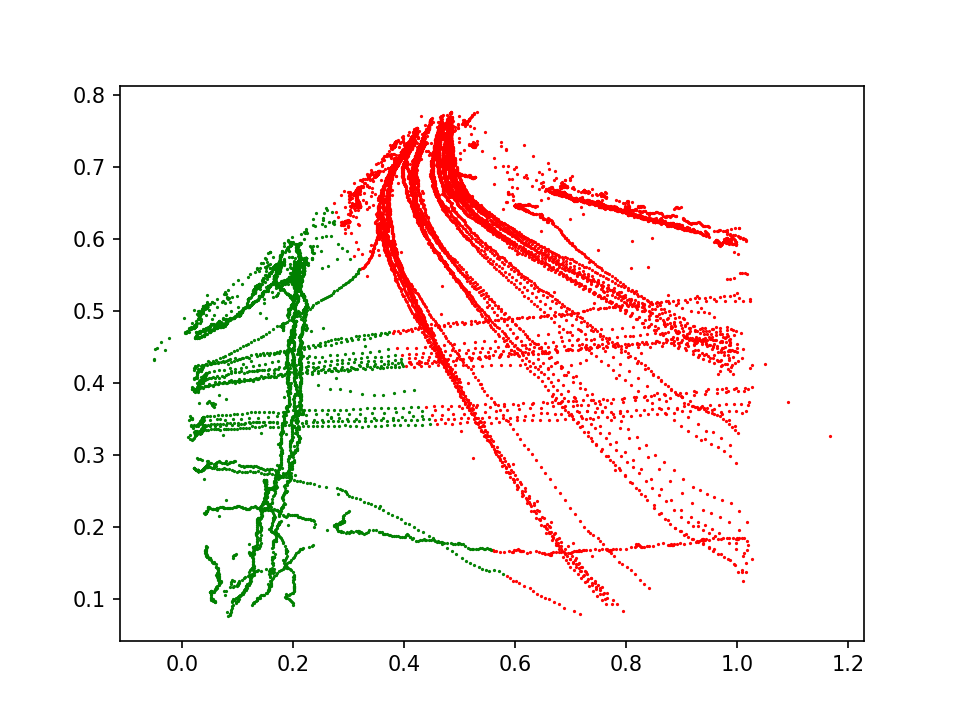
    <figcaption align="center">k_means algorithm with 2 initial cluster</figcaption>
</figure>
<figure>
    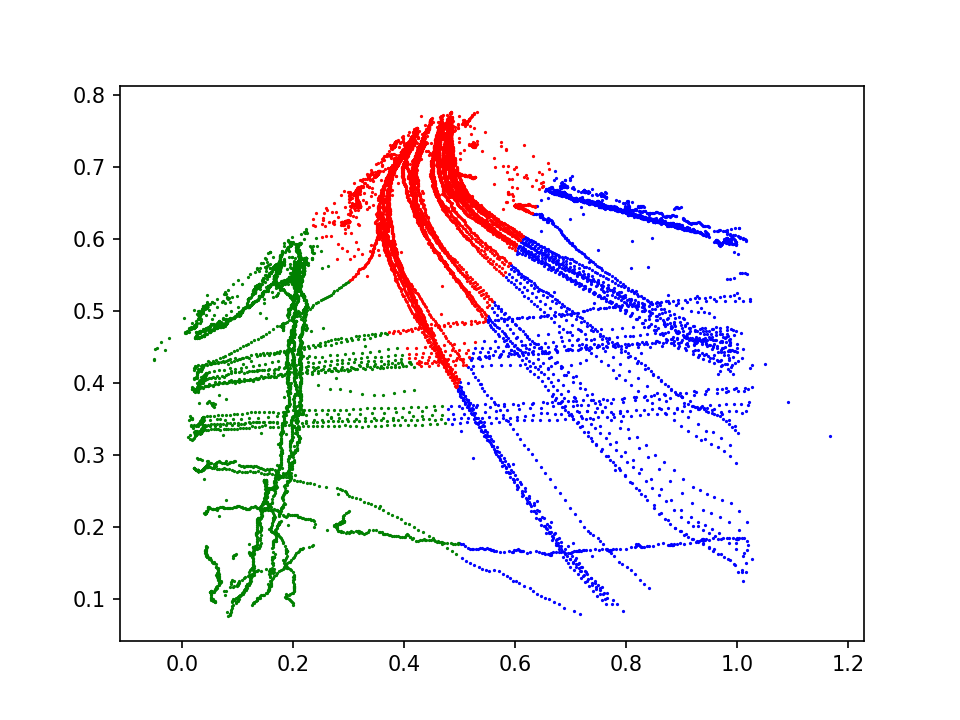
    <figcaption align="center">k_means algorithm with 3 initial cluster</figcaption>
</figure>
<figure>
    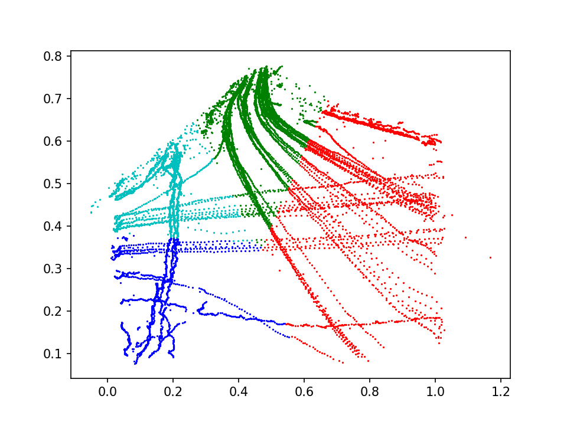
    <figcaption align="center">k_means algorithm with 4 initial cluster</figcaption>
</figure>

13.  Using clustering on all detection data, seems to be pointsless, the algorithms cant discriminate different directions from each other. A better approach would be, creating feature vectors from trajectories, then run the clustering algorithms on the extracted features. Here there are 2 functions, that extract feature vectors from detections and tracks. The first function that makes feature vectors containing only one coordinate hasnt been updated, because other function that extracts 4 dimension feature vectors (containing 2 coordinates) gave better results. 
```python
def makeFeatureVectors_Nx2(trackedObjects: list) -> np.ndarray:
    """Create 2D feature vectors from tracks.
    The enter and exit coordinates are put in different vectors. Only creating 2D vectors.

    Args:
        trackedObjects (list): list of tracked objects 

    Returns:
        np.ndarray: numpy array of feature vectors 
    """
    featureVectors = [] 
    for obj in trackedObjects:
        featureVectors.append(obj.history[0].X, obj.history[0].Y)
        featureVectors.append(obj.history[-1].X, obj.history[-1].Y)
    return np.array(featureVectors)

def makeFeatureVectorsNx4(trackedObjects: list) -> np.ndarray:
    """Create 4D feature vectors from tracks.
    The enter and exit coordinates are put in one vector. Creating 4D vectors.
    v = [enterX, enterY, exitX, exitY]

    Args:
        trackedObjects (list): list of tracked objects 

    Returns:
        np.ndarray: numpy array of feature vectors 
    """
    featureVectors = np.array([np.array([obj.history[0].X, obj.history[0].Y, obj.history[-1].X, obj.history[-1].Y]) for obj in tqdm.tqdm(trackedObjects, desc="Feature vectors.")])
    return featureVectors
```

14.  Slow loggin problem solved, big improvement in speed. Creation of shell scripts, which enables sqlite3's Write-Ahead Logging. 4x - 6x times speed improvement. Best solution to slow runtime is to implement a buffer, that stores all detections and predictions, then log them at the end before exiting.  

15.  First try at feature extraction and clustering. First I chose Affinity Propagation Clustring algorithm. AffinityPropagation creates clusters by sending messages between pairs of samples until convergence. A dataset is then described using a small number of exemplars, which are identified as those most representative of other samples. The messages sent between pairs represent the suitability for one sample to be the exemplar of the other, which is updated in response to the values from other pairs. This updating happens iteratively until convergence, at which point the final exemplars are chosen, and hence the final clustering is given. Affinity Propagation can be interesting as it chooses the number of clusters based on the data provided. For this purpose, the two important parameters are the preference, which controls how many exemplars are used, and the damping factor which damps the responsibility and availability messages to avoid numerical oscillations when updating these messages. Algorithm description: The messages sent between points belong to one of two categories. The first is the responsibility $r(i, k)$, which is the accumulated evidence that sample $k$ should be the exemplar for sample $i$. The second is the availability $a(i, k)$ which is the accumulated evidence that sample $i$ should choose $k$ sample to be its exemplar, and considers the values for all other samples that $k$ should be an exemplar. In this way, exemplars are chosen by samples if they are (1) similar enough to many samples and (2) chosen by many samples to be representative of themselves.  More formally, the responsibility of a sample $k$ to be the exemplar of sample $i$ is given by: $$r(i, k) \leftarrow s(i, k) - max [ a(i, k') + s(i, k') \forall k' \neq k ]$$  
Where $s(i, k)$ is the similarity between samples $i$ and $k$. The availability of sample $k$ to be the exemplar of sample $i$ is given by: $$a(i, k) \leftarrow min [0, r(k, k) + \sum_{i'~s.t.~i' \notin \{i, k\}}{r(i', k)}]$$  
To begin with, all values for $r$ and $a$ are set to zero, and the calculation of each iterates until convergence. As discussed above, in order to avoid numerical oscillations when updating the messages, the damping factor $\lambda$ is introduced to iteration process: $$r_{t+1}(i, k) = \lambda\cdot r_{t}(i, k) + (1-\lambda)\cdot r_{t+1}(i, k)$$ $$a_{t+1}(i, k) = \lambda\cdot a_{t}(i, k) + (1-\lambda)\cdot a_{t+1}(i, k)$$ where $t$ indicates the iteration times.  

16. Although affinity propagation does not require initial cluster number, it seems that the results are not usable, because it finds too meny clusters. Other algorithm should be tested ex.: K-Mean, Spectral. For better results, detections should be filtered out, because of false positive detections. Standing objects were detected, so those should be filtered out. The algorithm to filter out only the best data to run clustering on is based on the euclidean distance between enter and exit point pairs. $$d(p,q) = \sqrt{\sum_{i=1}^{n}{(p_i - q_i)^2}}$$

 
<figure>
    
    <figcaption align="center">Result of affinity propagation on video 0005_2_36min.mp4 on 2D feature vectors</figcaption>
<figure>

1.  Kmeans and Spectral clustering give far better results with the filtered detections, than affinity propagation. Here are the results on the 0005_2_36min.mp4 video.

<figure>
    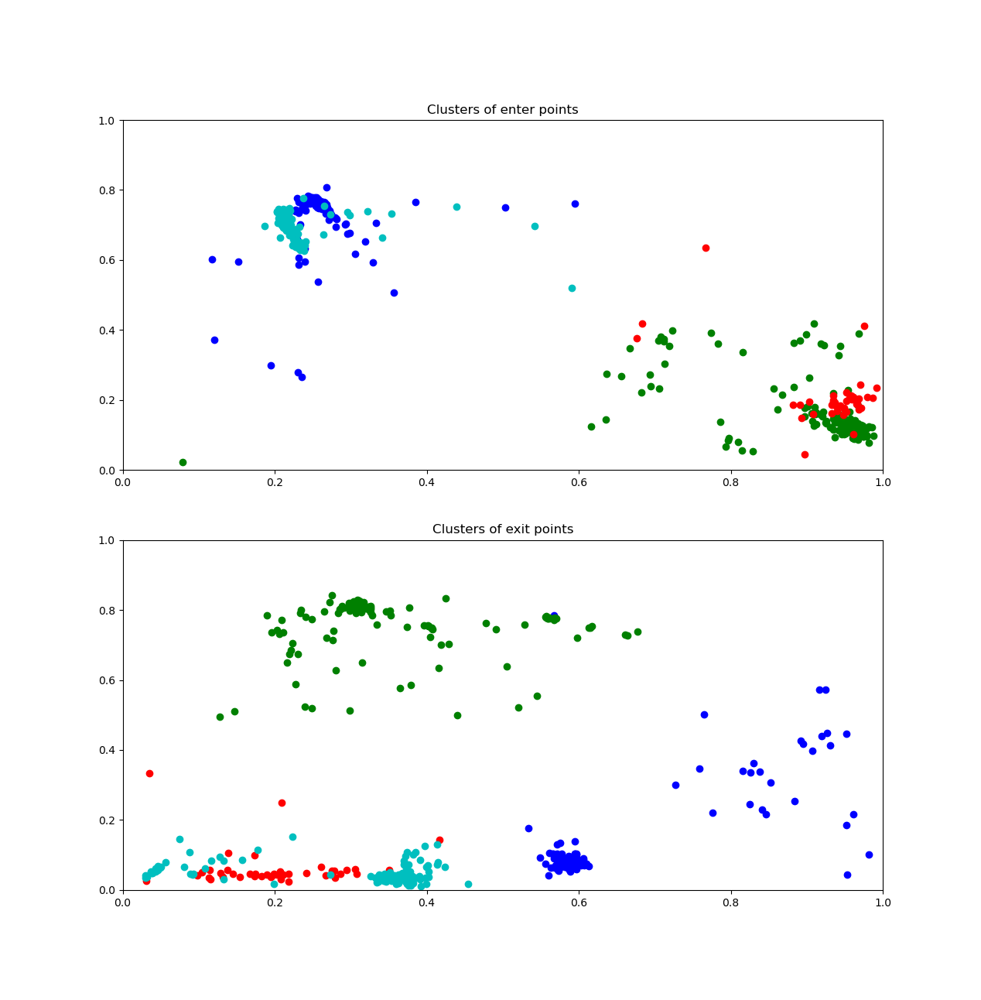
    <figcaption align="center">Result of kmeans clustering on 0005_2_36min.mp4</figcaption>
</figure>
<figure>
    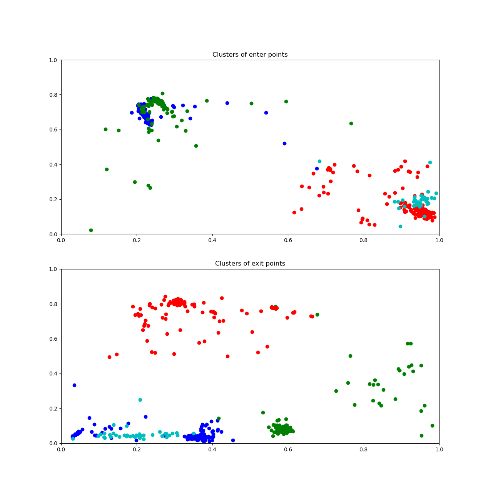
    <figcaption align="center">Result of spectral clustering on 0005_2_36min.mp4</figcaption>
</figure>

17. Finding the optimal number of clusters is very important step to be able to build and train a model. There are many algorithms to evaluate results of clusterings. Also from the evaluation results, we have to tell, which evaluation score is the most optimal, for this, the elbow diagram will give the guidance to find it.

18. To be able to run evaluation algorithm on kmeans clustering results, detections have to be assinged to object tracks. That is an easy task, when there are not many objects and detections in the database, but when 27000 objects and 300000 detections in there, things can go very bad, even if multiprocessing is involved, although I implemented multiprocessing into the algorithm, it wasnt worth it. The solution is to do preprocessing on the data, that means, doing the assignment in the SQL queries. This also can be done with multiprocessing. The new soltion to process data performs very good, it takes only 6 mins instead of 21 mins, on the largest database.

19. To be able to mass produce elbow diagrams, new functions had to be implemented, that can create plots in a flexible way. With these plots, the optimal number of clusters can be chosen.  

20. The results from the clustering are promising, but with a better filtering algorithm, it can be better. To decrease the number of bad detections, we can use only the detections, that are a certain distance from the edge detections.

21. To gather more results on clustering, new algorithms were tested, like DBSCAN and OPTICS. 
22. The DBSCAN algorithm views clusters as areas of high density separated by areas of low density. Due to this rather generic view, clusters found by DBSCAN can be any shape, as opposed to k-means which assumes that clusters are convex shaped. The central component to the DBSCAN is the concept of core samples, which are samples that are in areas of high density. A cluster is therefore a set of core samples, each close to each other (measured by some distance measure) and a set of non-core samples that are close to a core sample (but are not themselves core samples). There are two parameters to the algorithm, min_samples and eps, which define formally what we mean when we say dense. Higher min_samples or lower eps indicate higher density necessary to form a cluster. More formally, we define a core sample as being a sample in the dataset such that there exist min_samples other samples within a distance of eps, which are defined as neighbors of the core sample. This tells us that the core sample is in a dense area of the vector space. A cluster is a set of core samples that can be built by recursively taking a core sample, finding all of its neighbors that are core samples, finding all of their neighbors that are core samples, and so on. A cluster also has a set of non-core samples, which are samples that are neighbors of a core sample in the cluster but are not themselves core samples. Intuitively, these samples are on the fringes of a cluster. Any core sample is part of a cluster, by definition. Any sample that is not a core sample, and is at least eps in distance from any core sample, is considered an outlier by the algorithm. While the parameter min_samples primarily controls how tolerant the algorithm is towards noise (on noisy and large data sets it may be desirable to increase this parameter), the parameter eps is crucial to choose appropriately for the data set and distance function and usually cannot be left at the default value. It controls the local neighborhood of the points. When chosen too small, most data will not be clustered at all (and labeled as -1 for “noise”). When chosen too large, it causes close clusters to be merged into one cluster, and eventually the entire data set to be returned as a single cluster.  
23. The OPTICS algorithm shares many similarities with the DBSCAN algorithm, and can be considered a generalization of DBSCAN that relaxes the eps requirement from a single value to a value range. The key difference between DBSCAN and OPTICS is that the OPTICS algorithm builds a reachability graph, which assigns each sample both a reachability_ distance, and a spot within the cluster ordering_ attribute; these two attributes are assigned when the model is fitted, and are used to determine cluster membership. If OPTICS is run with the default value of inf set for max_eps, then DBSCAN style cluster extraction can be performed repeatedly in linear time for any given eps value using the cluster_optics_dbscan method. Setting max_eps to a lower value will result in shorter run times, and can be thought of as the maximum neighborhood radius from each point to find other potential reachable points. The reachability distances generated by OPTICS allow for variable density extraction of clusters within a single data set. As shown in the above plot, combining reachability distances and data set ordering_ produces a reachability plot, where point density is represented on the Y-axis, and points are ordered such that nearby points are adjacent. ‘Cutting’ the reachability plot at a single value produces DBSCAN like results; all points above the ‘cut’ are classified as noise, and each time that there is a break when reading from left to right signifies a new cluster. The default cluster extraction with OPTICS looks at the steep slopes within the graph to find clusters, and the user can define what counts as a steep slope using the parameter xi.

24. As can be read above, DBSCAN can yield different results, when the dataset is shuffled, so I wrote a simple dataset shuffling function. The results are saved in the shuffled dir.

25. Optics had been giving the best results so far. An example command that gave me a good result: `python3 dataAnalyzer.py -db research_data/0001_2_308min/0001_2_308min.db --classification --min_samples 10 --max_eps 0.1 --xi 0.15 --n_neighbours 15`

Optics clustering with parameters of min_samples = 20, max_eps = 2.0, xi = 0.1, min_cluster_size = 0.05 and filtering algorithm with threshold = 0.4
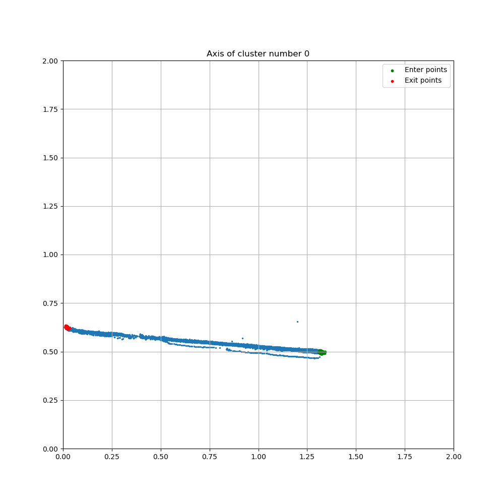
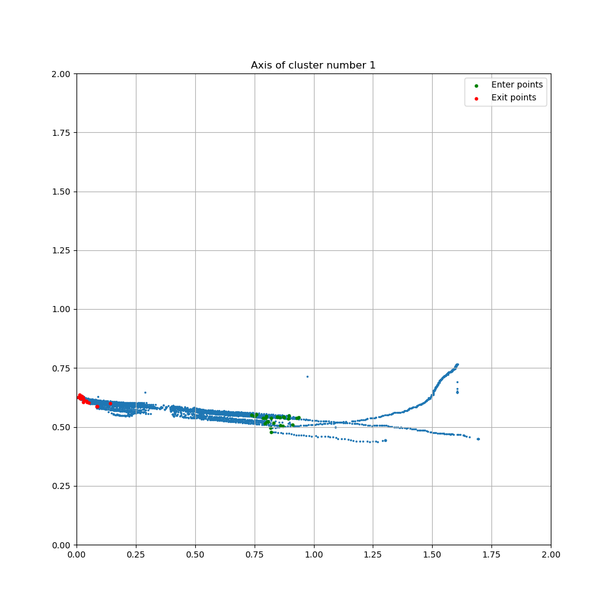
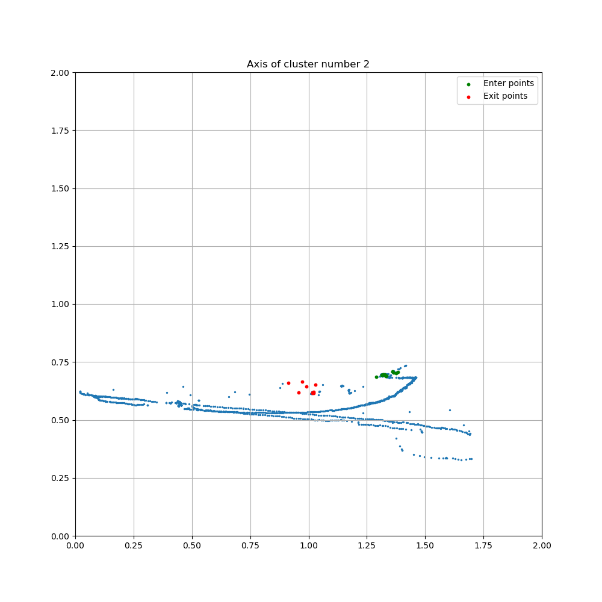
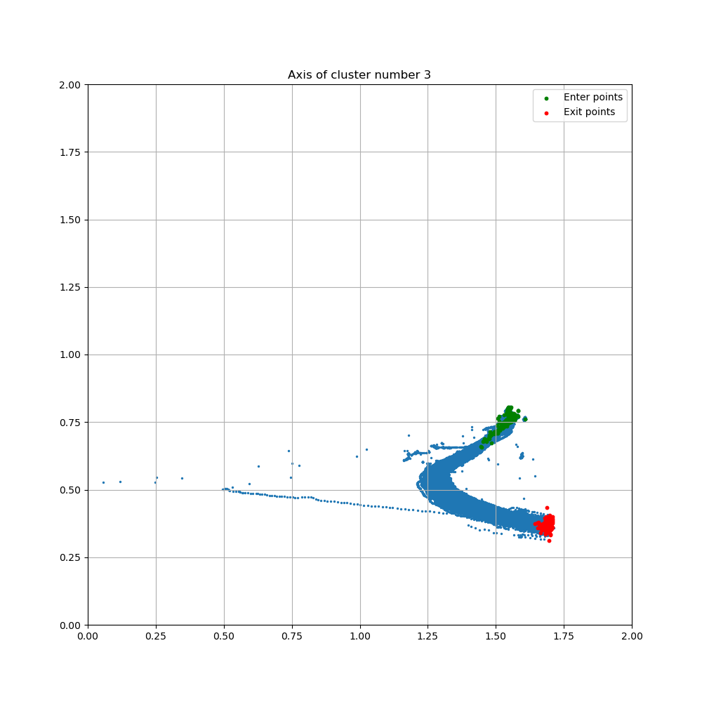
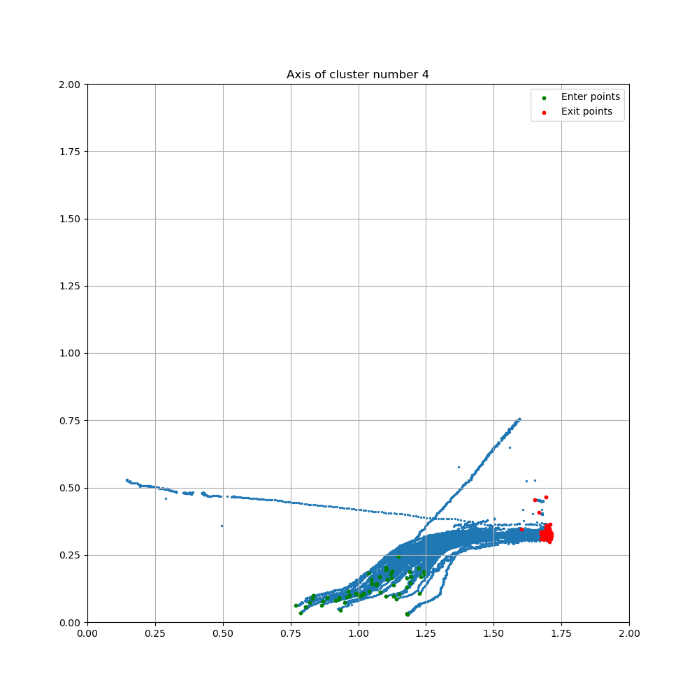
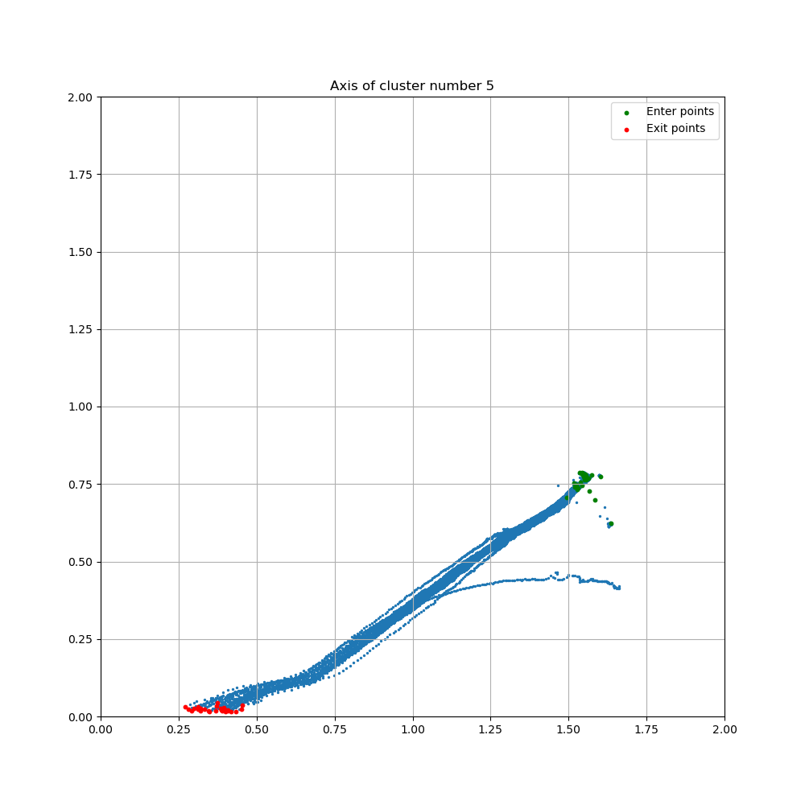
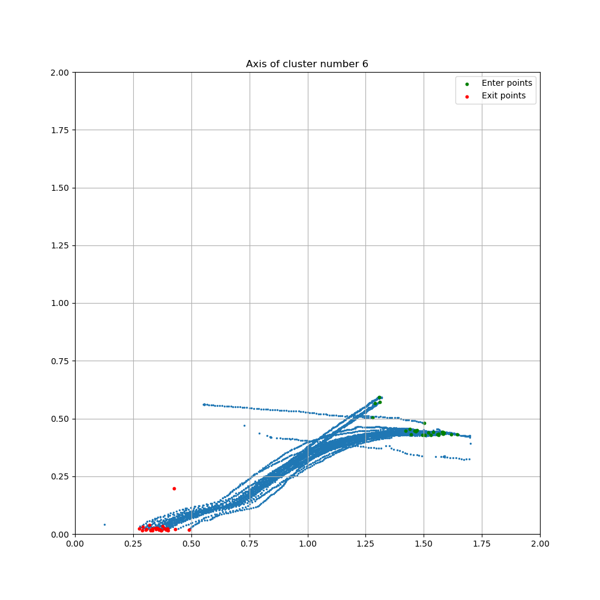

26. The results of the clustering are the classes used in classification. There are many classification algorithm, ex.: [KNN](https://scikit-learn.org/stable/modules/neighbors.html#nearest-neighbors-classification), [GaussianNB](https://scikit-learn.org/stable/modules/naive_bayes.html#gaussian-naive-bayes), [StochasticGradientDescent](https://scikit-learn.org/stable/modules/sgd.html#classification), etc... [Neural Network Models](https://scikit-learn.org/stable/modules/neural_networks_supervised.html#classification) also can be used for classification.

### Classification Results

#### 0002_2_308min.mp4

`python3 dataAnalyzer.py -db research_data/0002_2_308min/0002_2_308min.db --min_samples 10 --max_eps 0.1 --xi 0.15 --min_cluster_size 10 --ClassificationWorker`

| Classification | Accuracy - non calibrated | Accuracy - calibrated | Accuracy - five fold method | Accuracy - FeatureVectorShape (enter, enter_vel, middle, exit, exit_vel)    |
|----------------|---------------------------|-----------------------|-----------------------------|---------------------------|
| KNN            | 70.6185 %                 | 46.0154 %             | 62.6898 %                   | 70.3608 %                 |
| SGD            | 39.1752 %                 | 25.1928 %             | 38.8286 %                   | 42.7835 %                 |
| GP             | 42.2680 %                 | 31.1053 %             | 39.6963 %                   | 42.5257 %                 |
| GNB            | 27.3195 %                 | 28.7917 %             | 30.3687 %                   | 37.3711 %                 |
| MLP            | 50.2577 %                 | 30.3341 %             | 43.3839 %                   | 53.8659 %                 |
| Voting         | 47.9381 %                 |                       |                             | 60.0515 %                 |
| SVM            | 55.0976 %                 |                       |                             | 49.4845 %                 |
| DT             |                           |                       |                             | 69.9300 %                 |

#### 0001_2_308min.mp4

`python3 dataAnalyzer.py -db research_data/0001_2_308min/0001_2_308min.db --min_samples 10 --max_eps 0.2 --xi 0.15 --min_cluster_size 10 --ClassificationWorker`

| Classification | Accuracy - non calibrated | Accuracy - calibrated | Accuracy - five fold method | Accuracy - FeatureVectorShape (enter, enter_vel, middle, exit, exit_vel)   |
|----------------|---------------------------|-----------------------|-----------------------------|--------------------------|
| KNN            | 77.0967 %                 | 72.1934 %             |                             | 80.2768 %                |
| SGD            | 50.3227 %                 | 62.6943 %             |                             | 62.4567 %                |
| GP             | 58.3870 %                 | 64.0759 %             |                             | 62.2837 %                |
| GNB            | 54.1935 %                 | 62.5215 %             |                             | 69.7231 %                |
| MLP            | 67.7419 %                 | 66.1485 %             |                             | 73.7024 %                |
| Voting         | 68.3871 %                 |                       |                             | 72.6643 %                |
| SVM            | 49.1758 %                 |                       |                             | 68.5121 %                |
| DT             |                           |                       |                             |                          | 

#### Binary classifier results

The accuracy is the proportion of correct predictions (both true positives and true negatives) among the total number of cases examined.

$$ Accuracy = \frac{(TP + TN)}{(TP + TN + FP + FN)} $$

##### With feature vector shape (enter, middle, exit)

###### 0001_2_308min.mp4

|    |      KNN |       GP |      GNB |      MLP |      SGD |      SVM |
|---:|---------:|---------:|---------:|---------:|---------:|---------:|
|  0 | 0.975779 | 0.975779 | 0.925606 | 0.975779 | 0.974048 | 0.980969 |
|  1 | 0.970588 | 0.980969 | 0.937716 | 0.980969 | 0.977509 | 0.967128 |
|  2 | 0.974048 | 0.974048 | 0.927336 | 0.972318 | 0.975779 | 0.972318 |
|  3 | 0.972318 | 0.974048 | 0.946367 | 0.937716 | 0.968858 | 0.974048 |
|  4 | 0.949827 | 0.942907 | 0.653979 | 0.942907 | 0.941176 | 0.944637 |
|  5 | 0.982699 | 0.974048 | 0.946367 | 0.974048 | 0.972318 | 0.982699 |
|  6 | 0.979239 | 0.965398 | 0.963668 | 0.967128 | 0.946367 | 0.974048 |
|  7 | 0.918685 | 0.852941 | 0.787197 | 0.823529 | 0.821799 | 0.901384 |
|  8 | 0.982699 | 0.956747 | 0.591696 | 0.956747 | 0.745675 | 0.974048 |
|  9 | 0.980969 | 0.955017 | 0.939446 | 0.941176 | 0.894464 | 0.968858 |
| 10 | 0.977509 | 0.949827 | 0.937716 | 0.949827 | 0.967128 | 0.970588 |
| 11 | 0.974048 | 0.963668 | 0.896194 | 0.970588 | 0.970588 | 0.974048 |
| 12 | 0.961938 | 0.953287 | 0.951557 | 0.951557 | 0.953287 | 0.955017 |
| 13 | 0.982699 | 0.956747 | 0.887543 | 0.956747 | 0.949827 | 0.958478 |
| 14 | 0.989619 | 0.982699 | 0.965398 | 0.982699 | 0.982699 | 0.991349 |

##### 0002_2_308min.mp4

|    |      KNN |       GP |      GNB |      MLP |      SGD |      SVM |
|---:|---------:|---------:|---------:|---------:|---------:|---------:|
|  0 | 0.966495 | 0.945876 | 0.811856 | 0.945876 | 0.945876 | 0.945876 |
|  1 | 0.956186 | 0.917526 | 0.71134  | 0.914948 | 0.930412 | 0.945876 |
|  2 | 0.940722 | 0.943299 | 0.943299 | 0.943299 | 0.938144 | 0.935567 |
|  3 | 0.938144 | 0.899485 | 0.886598 | 0.899485 | 0.884021 | 0.920103 |
|  4 | 0.963918 | 0.969072 | 0.842784 | 0.969072 | 0.966495 | 0.974227 |
|  5 | 0.963918 | 0.914948 | 0.914948 | 0.914948 | 0.917526 | 0.958763 |
|  6 | 0.956186 | 0.938144 | 0.842784 | 0.938144 | 0.938144 | 0.958763 |
|  7 | 0.953608 | 0.889175 | 0.806701 | 0.89433  | 0.881443 | 0.925258 |
|  8 | 0.953608 | 0.886598 | 0.768041 | 0.886598 | 0.899485 | 0.935567 |
|  9 | 0.966495 | 0.958763 | 0.708763 | 0.958763 | 0.963918 | 0.966495 |
| 10 | 0.963918 | 0.963918 | 0.96134  | 0.963918 | 0.963918 | 0.966495 |
| 11 | 0.966495 | 0.951031 | 0.951031 | 0.951031 | 0.951031 | 0.971649 |
| 12 | 0.93299  | 0.917526 | 0.858247 | 0.917526 | 0.917526 | 0.940722 |
| 13 | 0.948454 | 0.930412 | 0.878866 | 0.930412 | 0.930412 | 0.943299 |

##### With feature vector shape (enter, enter_velocity, middle, exit, exit_velocity)

###### 0001_2_308min.mp4

|    |      KNN |       GP |      GNB |      MLP |      SGD |      SVM |
|---:|---------:|---------:|---------:|---------:|---------:|---------:|
|  0 | 0.975779 | 0.975779 | 0.922145 | 0.975779 | 0.974048 | 0.980969 |
|  1 | 0.970588 | 0.980969 | 0.930796 | 0.980969 | 0.979239 | 0.974048 |
|  2 | 0.974048 | 0.974048 | 0.922145 | 0.972318 | 0.974048 | 0.974048 |
|  3 | 0.972318 | 0.974048 | 0.946367 | 0.937716 | 0.939446 | 0.972318 |
|  4 | 0.949827 | 0.942907 | 0.934256 | 0.942907 | 0.944637 | 0.948097 |
|  5 | 0.982699 | 0.974048 | 0.930796 | 0.974048 | 0.974048 | 0.982699 |
|  6 | 0.979239 | 0.965398 | 0.963668 | 0.967128 | 0.960208 | 0.970588 |
|  7 | 0.918685 | 0.851211 | 0.821799 | 0.820069 | 0.681661 | 0.870242 |
|  8 | 0.986159 | 0.956747 | 0.922145 | 0.956747 | 0.960208 | 0.974048 |
|  9 | 0.980969 | 0.958478 | 0.948097 | 0.946367 | 0.960208 | 0.967128 |
| 10 | 0.979239 | 0.949827 | 0.491349 | 0.949827 | 0.967128 | 0.970588 |
| 11 | 0.974048 | 0.963668 | 0.906574 | 0.970588 | 0.970588 | 0.974048 |
| 12 | 0.961938 | 0.953287 | 0.517301 | 0.951557 | 0.951557 | 0.955017 |
| 13 | 0.982699 | 0.956747 | 0.963668 | 0.956747 | 0.948097 | 0.956747 |
| 14 | 0.989619 | 0.982699 | 0.967128 | 0.982699 | 0.982699 | 0.991349 |

|     | AVG      |
|:----|---------:|
| KNN | 0.971857 |
| GP  | 0.957324 |
| GNB | 0.872549 |
| MLP | 0.951442 |
| SGD | 0.913033 |
| SVM | 0.963668 |

###### Balanced Accuracy - 0.4

|    |      KNN |       GP |      GNB |      MLP |      SGD |      SVM |       DT |
|---:|---------:|---------:|---------:|---------:|---------:|---------:|---------:|
|  0 | 0.671479 | 0.5      | 0.890451 | 0.5      | 0.496454 | 0.641971 | 0.745567 |
|  1 | 0.672118 | 0.5      | 0.920154 | 0.5      | 0.499118 | 0.539282 | 0.584736 |
|  2 | 0.59286  | 0.53125  | 0.562611 | 0.5      | 0.62411  | 0.591971 | 0.581294 |
|  3 | 0.906519 | 0.83892  | 0.932503 | 0.680556 | 0.927891 | 0.830566 | 0.879664 |
|  4 | 0.679066 | 0.5      | 0.592299 | 0.5      | 0.544537 | 0.573923 | 0.715819 |
|  5 | 0.954233 | 0.499112 | 0.960924 | 0.5      | 0.5      | 0.858674 | 0.863114 |
|  6 | 0.913003 | 0.499106 | 0.879531 | 0.5      | 0.723425 | 0.834055 | 0.838527 |
|  7 | 0.919514 | 0.840237 | 0.848447 | 0.838153 | 0.842949 | 0.880991 | 0.869662 |
|  8 | 0.895479 | 0.54     | 0.607089 | 0.5      | 0.638192 | 0.86915  | 0.914575 |
|  9 | 0.956049 | 0.950257 | 0.947973 | 0.932625 | 0.956918 | 0.950257 | 0.920174 |
| 10 | 0.906507 | 0.5      | 0.71591  | 0.5      | 0.863639 | 0.837542 | 0.853872 |
| 11 | 0.615865 | 0.583779 | 0.918895 | 0.5      | 0.583779 | 0.702317 | 0.672906 |
| 12 | 0.625    | 0.534805 | 0.660714 | 0.5      | 0.534805 | 0.535714 | 0.623766 |
| 13 | 0.990054 | 0.615479 | 0.830054 | 0.5      | 0.498192 | 0.614575 | 0.918192 |
| 14 | 0.7      | 0.5      | 0.836796 | 0.5      | 0.69912  | 0.75     | 0.793838 |

|     |        0 |
|:----|---------:|
| KNN | 0.79985  |
| GP  | 0.59553  |
| GNB | 0.806957 |
| MLP | 0.563422 |
| SGD | 0.662209 |
| SVM | 0.734066 |
| DT  | 0.785047 |

###### Balanced Accuracy - 0.5 

|    |      KNN |       GP |      GNB |      MLP |      SGD |      SVM |       DT |
|---:|---------:|---------:|---------:|---------:|---------:|---------:|---------:|
|  0 | 0.5      | 0.5      | 0.890451 | 0.5      | 0.498227 | 0.641971 | 0.745567 |
|  1 | 0.628427 | 0.5      | 0.920154 | 0.5      | 0.499118 | 0.541045 | 0.584736 |
|  2 | 0.53125  | 0.53125  | 0.56528  | 0.5      | 0.56161  | 0.591971 | 0.581294 |
|  3 | 0.907442 | 0.830566 | 0.932503 | 0.5      | 0.851937 | 0.803711 | 0.879664 |
|  4 | 0.57484  | 0.5      | 0.595051 | 0.5      | 0.544537 | 0.558771 | 0.715819 |
|  5 | 0.958674 | 0.5      | 0.964476 | 0.5      | 0.5      | 0.86045  | 0.863114 |
|  6 | 0.887581 | 0.499106 | 0.879531 | 0.5      | 0.619951 | 0.704265 | 0.838527 |
|  7 | 0.929265 | 0.870969 | 0.842197 | 0.840385 | 0.806743 | 0.884492 | 0.869662 |
|  8 | 0.897288 | 0.5      | 0.691971 | 0.5      | 0.578192 | 0.871863 | 0.914575 |
|  9 | 0.95991  | 0.881049 | 0.948938 | 0.780084 | 0.957272 | 0.938417 | 0.920174 |
| 10 | 0.891087 | 0.5      | 0.71591  | 0.5      | 0.890051 | 0.80488  | 0.853872 |
| 11 | 0.558824 | 0.496435 | 0.923351 | 0.5      | 0.524955 | 0.644385 | 0.672906 |
| 12 | 0.607143 | 0.517857 | 0.661623 | 0.5      | 0.516948 | 0.535714 | 0.623766 |
| 13 | 0.990958 | 0.5      | 0.790054 | 0.5      | 0.498192 | 0.615479 | 0.918192 |
| 14 | 0.7      | 0.5      | 0.786796 | 0.5      | 0.6      | 0.75     | 0.793838 |

|     |        0 |
|:----|---------:|
| KNN | 0.768179 |
| GP  | 0.575149 |
| GNB | 0.807219 |
| MLP | 0.541365 |
| SGD | 0.629849 |
| SVM | 0.716494 |
| DT  | 0.785047 |

###### Balanced Accuracy - 0.5 - FeatureVectors made from second half of track's history

|    |      KNN |       GP |      GNB |      MLP |      SGD |      SVM |       DT |
|---:|---------:|---------:|---------:|---------:|---------:|---------:|---------:|
|  0 | 0.717451 | 0.5      | 0.979184 | 0.5      | 0.5      | 0.696177 | 0.876602 |
|  1 | 0.914053 | 0.5      | 0.984707 | 0.5      | 0.5      | 0.756602 | 0.878726 |
|  2 | 0.70417  | 0.499572 | 0.819047 | 0.5      | 0.51385  | 0.658768 | 0.73887  |
|  3 | 0.95421  | 0.952441 | 0.957211 | 0.889945 | 0.946283 | 0.945841 | 0.970063 |
|  4 | 0.74912  | 0.583333 | 0.707813 | 0.5      | 0.582893 | 0.704545 | 0.791587 |
|  5 | 0.849205 | 0.5      | 0.970386 | 0.5      | 0.5      | 0.8876   | 0.956884 |
|  6 | 0.907247 | 0.5      | 0.857453 | 0.5      | 0.5      | 0.791862 | 0.933318 |
|  7 | 0.949784 | 0.877326 | 0.819823 | 0.888092 | 0.716641 | 0.888744 | 0.893161 |
|  8 | 0.888081 | 0.601695 | 0.789389 | 0.5      | 0.794586 | 0.834609 | 0.91263  |
|  9 | 0.940611 | 0.810352 | 0.90098  | 0.883699 | 0.716567 | 0.890815 | 0.96914  |
| 10 | 0.968889 | 0.617495 | 0.951392 | 0.5      | 0.875832 | 0.975614 | 0.900218 |
| 11 | 0.624145 | 0.5      | 0.891106 | 0.5      | 0.5      | 0.637206 | 0.825561 |
| 12 | 0.635923 | 0.49912  | 0.721684 | 0.5      | 0.596724 | 0.641739 | 0.767539 |
| 13 | 0.961769 | 0.786714 | 0.91907  | 0.617757 | 0.806217 | 0.786279 | 0.874403 |
| 14 | 0.865385 | 0.807692 | 0.873561 | 0.5      | 0.769231 | 0.884615 | 0.881214 |

|     |        0 |
|:----|---------:|
| KNN | 0.842003 |
| GP  | 0.635716 |
| GNB | 0.876187 |
| MLP | 0.5853   |
| SGD | 0.654588 |
| SVM | 0.798734 |
| DT  | 0.877994 |

###### Balanced Accuracy - 0.6 

|    |      KNN |       GP |      GNB |      MLP |      SGD |      SVM |       DT |
|---:|---------:|---------:|---------:|---------:|---------:|---------:|---------:|
|  0 | 0.5      | 0.5      | 0.893997 | 0.5      | 0.499113 | 0.570542 | 0.745567 |
|  1 | 0.629309 | 0.5      | 0.920154 | 0.5      | 0.499118 | 0.541927 | 0.584736 |
|  2 | 0.53125  | 0.53125  | 0.56706  | 0.5      | 0.53125  | 0.560721 | 0.581294 |
|  3 | 0.868542 | 0.802788 | 0.934348 | 0.5      | 0.822263 | 0.803711 | 0.879664 |
|  4 | 0.559689 | 0.5      | 0.595969 | 0.5      | 0.529386 | 0.558771 | 0.715819 |
|  5 | 0.82534  | 0.5      | 0.968028 | 0.5      | 0.5      | 0.794671 | 0.863114 |
|  6 | 0.863054 | 0.499106 | 0.880426 | 0.5      | 0.522738 | 0.706054 | 0.838527 |
|  7 | 0.930141 | 0.848681 | 0.844551 | 0.797325 | 0.733703 | 0.856743 | 0.869662 |
|  8 | 0.897288 | 0.5      | 0.652767 | 0.5      | 0.539096 | 0.871863 | 0.914575 |
|  9 | 0.952542 | 0.691313 | 0.948938 | 0.567278 | 0.958237 | 0.822716 | 0.920174 |
| 10 | 0.873846 | 0.5      | 0.718642 | 0.5      | 0.884649 | 0.78855  | 0.853872 |
| 11 | 0.529412 | 0.5      | 0.924242 | 0.5      | 0.527629 | 0.586453 | 0.672906 |
| 12 | 0.589286 | 0.5      | 0.66526  | 0.5      | 0.499091 | 0.535714 | 0.623766 |
| 13 | 0.972767 | 0.5      | 0.770054 | 0.5      | 0.498192 | 0.616383 | 0.918192 |
| 14 | 0.7      | 0.5      | 0.786796 | 0.5      | 0.5      | 0.75     | 0.793838 |

|     |        0 |
|:----|---------:|
| KNN | 0.748164 |
| GP  | 0.558209 |
| GNB | 0.804749 |
| MLP | 0.524307 |
| SGD | 0.602964 |
| SVM | 0.690988 |
| DT  | 0.785047 |


##### 0002_2_308min.mp4

|    |      KNN |       GP |      GNB |      MLP |      SGD |      SVM |
|---:|---------:|---------:|---------:|---------:|---------:|---------:|
|  0 | 0.966495 | 0.945876 | 0.780928 | 0.945876 | 0.945876 | 0.948454 |
|  1 | 0.958763 | 0.917526 | 0.752577 | 0.914948 | 0.935567 | 0.948454 |
|  2 | 0.940722 | 0.943299 | 0.603093 | 0.943299 | 0.917526 | 0.93299  |
|  3 | 0.938144 | 0.899485 | 0.474227 | 0.899485 | 0.891753 | 0.917526 |
|  4 | 0.963918 | 0.969072 | 0.96134  | 0.969072 | 0.966495 | 0.974227 |
|  5 | 0.963918 | 0.914948 | 0.487113 | 0.914948 | 0.868557 | 0.938144 |
|  6 | 0.956186 | 0.938144 | 0.698454 | 0.938144 | 0.938144 | 0.940722 |
|  7 | 0.956186 | 0.889175 | 0.801546 | 0.873711 | 0.896907 | 0.886598 |
|  8 | 0.953608 | 0.886598 | 0.618557 | 0.886598 | 0.876289 | 0.951031 |
|  9 | 0.979381 | 0.958763 | 0.67268  | 0.958763 | 0.966495 | 0.976804 |
| 10 | 0.963918 | 0.963918 | 0.716495 | 0.963918 | 0.963918 | 0.966495 |
| 11 | 0.966495 | 0.951031 | 0.914948 | 0.951031 | 0.951031 | 0.966495 |
| 12 | 0.93299  | 0.917526 | 0.907216 | 0.917526 | 0.917526 | 0.943299 |
| 13 | 0.951031 | 0.930412 | 0.878866 | 0.930412 | 0.930412 | 0.93299  |

|     |   AVG    |
|:----|---------:|
| KNN | 0.956554 |
| GP  | 0.930412 |
| GNB | 0.733432 |
| MLP | 0.929124 |
| SGD | 0.923417 |
| SVM | 0.945508 |

###### Balanced Accuracy - Threshold 0.4

|    |      KNN |       GP |      GNB |      MLP |      SGD |      SVM |       DT |                                            
|---:|---------:|---------:|---------:|---------:|---------:|---------:|---------:|                                            
|  0 | 0.888413 | 0.5      | 0.880109 | 0.5      | 0.498638 | 0.568704 | 0.842156 |                                            
|  1 | 0.815023 | 0.574349 | 0.786214 | 0.5      | 0.764277 | 0.765685 | 0.795647 |                                            
|  2 | 0.904496 | 0.5      | 0.781421 | 0.5      | 0.479508 | 0.577248 | 0.844511 |                                            
|  3 | 0.885901 | 0.5      | 0.697708 | 0.5      | 0.59676  | 0.692234 | 0.803321 |                                            
|  4 | 0.654699 | 0.5      | 0.978723 | 0.5      | 0.496011 | 0.74734  | 0.912677 |                                            
|  5 | 0.904524 | 0.528895 | 0.683781 | 0.5      | 0.510926 | 0.676184 | 0.774861 |                                            
|  6 | 0.92239  | 0.5      | 0.831044 | 0.5      | 0.478022 | 0.782051 | 0.804258 |                                            
|  7 | 0.91701  | 0.658196 | 0.856571 | 0.651557 | 0.664148 | 0.650069 | 0.843864 |                                            
|  8 | 0.891649 | 0.49564  | 0.679968 | 0.5      | 0.526823 | 0.897463 | 0.815011 |                                            
|  9 | 0.841062 | 0.5      | 0.761425 | 0.5      | 0.59375  | 0.842406 | 0.89953  |                                            
| 10 | 0.495989 | 0.5      | 0.756112 | 0.5      | 0.5      | 0.535714 | 0.597785 |                                            
| 11 | 0.784054 | 0.5      | 0.528241 | 0.5      | 0.5      | 0.732777 | 0.727357 |                                            
| 12 | 0.694698 | 0.5      | 0.606742 | 0.5      | 0.5      | 0.669066 | 0.726124 |                                            
| 13 | 0.746794 | 0.5      | 0.625115 | 0.5      | 0.5      | 0.605571 | 0.766697 |                                            

|     |        0 |                                                                                                             
|:----|---------:|                                                                                                             
| KNN | 0.810479 |                                                                                                             
| GP  | 0.518363 |                                                                                                             
| GNB | 0.746655 |                                                                                                             
| MLP | 0.510825 |                                             
| SGD | 0.54349  |                                             
| SVM | 0.695894 |                                             
| DT  | 0.7967   |     

###### Balanced Accuracy - Threshold 0.5

|    |      KNN |       GP |      GNB |     MLP |      SGD |      SVM |       DT |
|---:|---------:|---------:|---------:|--------:|---------:|---------:|---------:|
|  0 | 0.847606 | 0.5      | 0.884196 | 0.5     | 0.5      | 0.498638 | 0.864604 |
|  1 | 0.785062 | 0.515152 | 0.796073 | 0.5     | 0.724456 | 0.767093 | 0.779087 |
|  2 | 0.712245 | 0.5      | 0.768256 | 0.5     | 0.498634 | 0.57998  | 0.845877 |
|  3 | 0.817574 | 0.5      | 0.707736 | 0.5     | 0.495702 | 0.669459 | 0.814709 |
|  4 | 0.578014 | 0.5      | 0.980053 | 0.5     | 0.5      | 0.664007 | 0.912677 |
|  5 | 0.88408  | 0.5      | 0.692232 | 0.5     | 0.5      | 0.808323 | 0.795647 |
|  6 | 0.820971 | 0.5      | 0.839286 | 0.5     | 0.666896 | 0.661172 | 0.888965 |
|  7 | 0.901557 | 0.651557 | 0.861035 | 0.55174 | 0.82223  | 0.650069 | 0.851992 |
|  8 | 0.874736 | 0.5      | 0.685782 | 0.5     | 0.898388 | 0.863372 | 0.802193 |
|  9 | 0.75     | 0.5      | 0.769489 | 0.5     | 0.59375  | 0.779906 | 0.896841 |
| 10 | 0.5      | 0.5      | 0.784186 | 0.5     | 0.5      | 0.535714 | 0.630825 |
| 11 | 0.682856 | 0.5      | 0.530951 | 0.5     | 0.5      | 0.707816 | 0.753673 |
| 12 | 0.636412 | 0.5      | 0.593926 | 0.5     | 0.785112 | 0.670471 | 0.75316  |
| 13 | 0.665282 | 0.5      | 0.609367 | 0.5     | 0.582692 | 0.605571 | 0.781061 |

|     |        0 |
|:----|---------:|
| KNN | 0.746885 |
| GP  | 0.511908 |
| GNB | 0.750184 |
| MLP | 0.503696 |
| SGD | 0.61199  |
| SVM | 0.675828 |
| DT  | 0.812236 |

###### Balanced Accuracy - Threshold 0.5 - FeatureVectors made from second half of track's history
|    |      KNN |       GP |      GNB |     MLP  |      SGD |      SVM |       DT |
|---:|---------:|---------:|---------:|---------:|---------:|---------:|---------:|
|  0 | 0.847549 | 0.5      | 0.934582 | 0.5      | 0.496782 | 0.609132 | 0.92474  |
|  1 | 0.847881 | 0.747987 | 0.817821 | 0.519737 | 0.845329 | 0.79592  | 0.928709 |
|  2 | 0.899782 | 0.5      | 0.889971 | 0.5      | 0.499353 | 0.679091 | 0.911492 |
|  3 | 0.589489 | 0.5      | 0.852519 | 0.5      | 0.496713 | 0.527486 | 0.703395 |
|  4 | 0.817487 | 0.5      | 0.965553 | 0.5      | 0.5      | 0.758116 | 0.997487 |
|  5 | 0.915802 | 0.5      | 0.847744 | 0.5      | 0.587516 | 0.917565 | 0.879183 |
|  6 | 0.613145 | 0.5      | 0.915718 | 0.5      | 0.5      | 0.729521 | 0.715309 |
|  7 | 0.901088 | 0.782656 | 0.90724  | 0.747896 | 0.499287 | 0.787048 | 0.936561 |
|  8 | 0.66338  | 0.5      | 0.823465 | 0.5      | 0.586512 | 0.79648  | 0.714298 |
|  9 | 0.867012 | 0.5      | 0.796136 | 0.5      | 0.676471 | 0.764706 | 0.940541 |
| 10 | 0.617487 | 0.5      | 0.819196 | 0.5      | 0.5      | 0.519372 | 0.671834 |
| 11 | 0.921799 | 0.5      | 0.701617 | 0.5      | 0.5      | 0.860579 | 0.948079 |
| 12 | 0.812101 | 0.5      | 0.624472 | 0.5      | 0.626474 | 0.729436 | 0.799816 |
| 13 | 0.796823 | 0.499336 | 0.734972 | 0.5      | 0.498672 | 0.709251 | 0.878418 |

|     |        0 |
|:----|---------:|
| KNN | 0.79363  |
| GP  | 0.537856 |
| GNB | 0.830786 |
| MLP | 0.519117 |
| SGD | 0.558079 |
| SVM | 0.727407 |
| DT  | 0.853562 |

###### Balanced Accuracy - Threshold 0.6

|    |      KNN |       GP |      GNB |   MLP |      SGD |      SVM |       DT |
|---:|---------:|---------:|---------:|------:|---------:|---------:|---------:|
|  0 | 0.781627 | 0.5      | 0.885559 |   0.5 | 0.498638 | 0.498638 | 0.840794 |
|  1 | 0.739607 | 0.5      | 0.804524 |   0.5 | 0.68041  | 0.768502 | 0.799872 |
|  2 | 0.672255 | 0.5      | 0.786016 |   0.5 | 0.491803 | 0.559985 | 0.821783 |
|  3 | 0.807619 | 0.5      | 0.723496 |   0.5 | 0.495702 | 0.64525  | 0.830395 |
|  4 | 0.539007 | 0.5      | 0.980053 |   0.5 | 0.49867  | 0.62234  | 0.912677 |
|  5 | 0.856594 | 0.5      | 0.704908 |   0.5 | 0.568715 | 0.689927 | 0.797055 |
|  6 | 0.680632 | 0.5      | 0.846154 |   0.5 | 0.5      | 0.640339 | 0.804258 |
|  7 | 0.864583 | 0.649382 | 0.869963 |   0.5 | 0.665636 | 0.650069 | 0.824634 |
|  8 | 0.874736 | 0.5      | 0.691596 |   0.5 | 0.604915 | 0.78528  | 0.80074  |
|  9 | 0.71875  | 0.5      | 0.778898 |   0.5 | 0.71875  | 0.748656 | 0.89953  |
| 10 | 0.5      | 0.5      | 0.808251 |   0.5 | 0.5      | 0.535714 | 0.595111 |
| 11 | 0.682856 | 0.5      | 0.530951 |   0.5 | 0.5      | 0.709171 | 0.699686 |
| 12 | 0.639221 | 0.5      | 0.596735 |   0.5 | 0.5      | 0.654846 | 0.744558 |
| 13 | 0.628245 | 0.5      | 0.610752 |   0.5 | 0.535652 | 0.587052 | 0.763927 |

|     |        0 |
|:----|---------:|
| KNN | 0.713267 |
| GP  | 0.51067  |
| GNB | 0.758418 |
| MLP | 0.5      |
| SGD | 0.554207 |
| SVM | 0.649698 |
| DT  | 0.795359 |

## Testing for decision tree depth

### Video 0001_2

Decision Tree depth 2 accuracy
|    |   Depth 2 |   Depth 2 multiclass average |   Depth 2 one class prediction |
|---:|----------:|-----------------------------:|-------------------------------:|
|  0 |  0.5      |                     0.703933 |                       0.731834 |
|  1 |  0.5      |                   nan        |                     nan        |
|  2 |  0.59286  |                   nan        |                     nan        |
|  3 |  0.790744 |                   nan        |                     nan        |
|  4 |  0.57484  |                   nan        |                     nan        |
|  5 |  0.956898 |                   nan        |                     nan        |
|  6 |  0.706054 |                   nan        |                     nan        |
|  7 |  0.872719 |                   nan        |                     nan        |
|  8 |  0.66     |                   nan        |                     nan        |
|  9 |  0.962452 |                   nan        |                     nan        |
| 10 |  0.712298 |                   nan        |                     nan        |
| 11 |  0.5      |                   nan        |                     nan        |
| 12 |  0.5      |                   nan        |                     nan        |
| 13 |  0.932767 |                   nan        |                     nan        |
| 14 |  0.797359 |                   nan        |                     nan        |
Decision Tree depth 3 accuracy
|    |   Depth 3 |   Depth 3 multiclass average |   Depth 3 one class prediction |
|---:|----------:|-----------------------------:|-------------------------------:|
|  0 |  0.499113 |                     0.726864 |                       0.764706 |
|  1 |  0.543691 |                   nan        |                     nan        |
|  2 |  0.591081 |                   nan        |                     nan        |
|  3 |  0.891708 |                   nan        |                     nan        |
|  4 |  0.589992 |                   nan        |                     nan        |
|  5 |  0.858674 |                   nan        |                     nan        |
|  6 |  0.726109 |                   nan        |                     nan        |
|  7 |  0.908222 |                   nan        |                     nan        |
|  8 |  0.66     |                   nan        |                     nan        |
|  9 |  0.952542 |                   nan        |                     nan        |
| 10 |  0.716852 |                   nan        |                     nan        |
| 11 |  0.674688 |                   nan        |                     nan        |
| 12 |  0.534805 |                   nan        |                     nan        |
| 13 |  0.955479 |                   nan        |                     nan        |
| 14 |  0.8      |                   nan        |                     nan        |
Decision Tree depth 4 accuracy
|    |   Depth 4 |   Depth 4 multiclass average |   Depth 4 one class prediction |
|---:|----------:|-----------------------------:|-------------------------------:|
|  0 |  0.820542 |                      0.80093 |                       0.778547 |
|  1 |  0.897627 |                    nan       |                     nan        |
|  2 |  0.591081 |                    nan       |                     nan        |
|  3 |  0.868542 |                    nan       |                     nan        |
|  4 |  0.589074 |                    nan       |                     nan        |
|  5 |  0.891119 |                    nan       |                     nan        |
|  6 |  0.811317 |                    nan       |                     nan        |
|  7 |  0.913597 |                    nan       |                     nan        |
|  8 |  0.919096 |                    nan       |                     nan        |
|  9 |  0.952542 |                    nan       |                     nan        |
| 10 |  0.768576 |                    nan       |                     nan        |
| 11 |  0.702317 |                    nan       |                     nan        |
| 12 |  0.534805 |                    nan       |                     nan        |
| 13 |  0.955479 |                    nan       |                     nan        |
| 14 |  0.798239 |                    nan       |                     nan        |
Decision Tree depth 5 accuracy
|    |   Depth 5 |   Depth 5 multiclass average |   Depth 5 one class prediction |
|---:|----------:|-----------------------------:|-------------------------------:|
|  0 |  0.820542 |                      0.81307 |                       0.794118 |
|  1 |  0.9422   |                    nan       |                     nan        |
|  2 |  0.59286  |                    nan       |                     nan        |
|  3 |  0.894475 |                    nan       |                     nan        |
|  4 |  0.588157 |                    nan       |                     nan        |
|  5 |  0.892007 |                    nan       |                     nan        |
|  6 |  0.863949 |                    nan       |                     nan        |
|  7 |  0.912389 |                    nan       |                     nan        |
|  8 |  0.917288 |                    nan       |                     nan        |
|  9 |  0.938771 |                    nan       |                     nan        |
| 10 |  0.857515 |                    nan       |                     nan        |
| 11 |  0.674688 |                    nan       |                     nan        |
| 12 |  0.586558 |                    nan       |                     nan        |
| 13 |  0.917288 |                    nan       |                     nan        |
| 14 |  0.797359 |                    nan       |                     nan        |
Decision Tree depth 6 accuracy
|    |   Depth 6 |   Depth 6 multiclass average |   Depth 6 one class prediction |
|---:|----------:|-----------------------------:|-------------------------------:|
|  0 |  0.784828 |                     0.799032 |                       0.782007 |
|  1 |  0.631073 |                   nan        |                     nan        |
|  2 |  0.591081 |                   nan        |                     nan        |
|  3 |  0.895398 |                   nan        |                     nan        |
|  4 |  0.691465 |                   nan        |                     nan        |
|  5 |  0.92534  |                   nan        |                     nan        |
|  6 |  0.891159 |                   nan        |                     nan        |
|  7 |  0.916827 |                   nan        |                     nan        |
|  8 |  0.917288 |                   nan        |                     nan        |
|  9 |  0.929472 |                   nan        |                     nan        |
| 10 |  0.853872 |                   nan        |                     nan        |
| 11 |  0.674688 |                   nan        |                     nan        |
| 12 |  0.586558 |                   nan        |                     nan        |
| 13 |  0.898192 |                   nan        |                     nan        |
| 14 |  0.798239 |                   nan        |                     nan        |
Decision Tree depth 7 accuracy
|    |   Depth 7 |   Depth 7 multiclass average |   Depth 7 one class prediction |
|---:|----------:|-----------------------------:|-------------------------------:|
|  0 |  0.783055 |                     0.788302 |                       0.759516 |
|  1 |  0.583854 |                   nan        |                     nan        |
|  2 |  0.558941 |                   nan        |                     nan        |
|  3 |  0.869465 |                   nan        |                     nan        |
|  4 |  0.662997 |                   nan        |                     nan        |
|  5 |  0.928893 |                   nan        |                     nan        |
|  6 |  0.865738 |                   nan        |                     nan        |
|  7 |  0.919786 |                   nan        |                     nan        |
|  8 |  0.918192 |                   nan        |                     nan        |
|  9 |  0.920174 |                   nan        |                     nan        |
| 10 |  0.837542 |                   nan        |                     nan        |
| 11 |  0.674688 |                   nan        |                     nan        |
| 12 |  0.586558 |                   nan        |                     nan        |
| 13 |  0.917288 |                   nan        |                     nan        |
| 14 |  0.797359 |                   nan        |                     nan        |
Decision Tree depth 8 accuracy
|    |   Depth 8 |   Depth 8 multiclass average |   Depth 8 one class prediction |
|---:|----------:|-----------------------------:|-------------------------------:|
|  0 |  0.74734  |                     0.788764 |                       0.743945 |
|  1 |  0.585618 |                   nan        |                     nan        |
|  2 |  0.554493 |                   nan        |                     nan        |
|  3 |  0.881509 |                   nan        |                     nan        |
|  4 |  0.731415 |                   nan        |                     nan        |
|  5 |  0.929781 |                   nan        |                     nan        |
|  6 |  0.78679  |                   nan        |                     nan        |
|  7 |  0.919786 |                   nan        |                     nan        |
|  8 |  0.916383 |                   nan        |                     nan        |
|  9 |  0.919208 |                   nan        |                     nan        |
| 10 |  0.853872 |                   nan        |                     nan        |
| 11 |  0.703209 |                   nan        |                     nan        |
| 12 |  0.585649 |                   nan        |                     nan        |
| 13 |  0.917288 |                   nan        |                     nan        |
| 14 |  0.79912  |                   nan        |                     nan        |
Decision Tree depth 9 accuracy
|    |   Depth 9 |   Depth 9 multiclass average |   Depth 9 one class prediction |
|---:|----------:|-----------------------------:|-------------------------------:|
|  0 |  0.746454 |                     0.790632 |                       0.735294 |
|  1 |  0.630191 |                   nan        |                     nan        |
|  2 |  0.584853 |                   nan        |                     nan        |
|  3 |  0.878741 |                   nan        |                     nan        |
|  4 |  0.714429 |                   nan        |                     nan        |
|  5 |  0.896448 |                   nan        |                     nan        |
|  6 |  0.839422 |                   nan        |                     nan        |
|  7 |  0.917098 |                   nan        |                     nan        |
|  8 |  0.915479 |                   nan        |                     nan        |
|  9 |  0.926577 |                   nan        |                     nan        |
| 10 |  0.837542 |                   nan        |                     nan        |
| 11 |  0.673797 |                   nan        |                     nan        |
| 12 |  0.582013 |                   nan        |                     nan        |
| 13 |  0.918192 |                   nan        |                     nan        |
| 14 |  0.798239 |                   nan        |                     nan        |
Decision Tree depth 10 accuracy
|    |   Depth 10 |   Depth 10 multiclass average |   Depth 10 one class prediction |
|---:|-----------:|------------------------------:|--------------------------------:|
|  0 |   0.745567 |                      0.784341 |                        0.714533 |
|  1 |   0.584736 |                    nan        |                      nan        |
|  2 |   0.584853 |                    nan        |                      nan        |
|  3 |   0.853731 |                    nan        |                      nan        |
|  4 |   0.699277 |                    nan        |                      nan        |
|  5 |   0.896448 |                    nan        |                      nan        |
|  6 |   0.812212 |                    nan        |                      nan        |
|  7 |   0.913536 |                    nan        |                      nan        |
|  8 |   0.915479 |                    nan        |                      nan        |
|  9 |   0.919208 |                    nan        |                      nan        |
| 10 |   0.83572  |                    nan        |                      nan        |
| 11 |   0.702317 |                    nan        |                      nan        |
| 12 |   0.583831 |                    nan        |                      nan        |
| 13 |   0.918192 |                    nan        |                      nan        |
| 14 |   0.8      |                    nan        |                      nan        |

## Accuraciy (features v2)

## Examples

## References

### Darknet-YOLO

<a id="1">[1]</a>  
@misc{bochkovskiy2020yolov4,  
      title={YOLOv4: Optimal Speed and Accuracy of Object Detection},  
      author={Alexey Bochkovskiy and Chien-Yao Wang and Hong-Yuan Mark Liao},  
      year={2020},  
      eprint={2004.10934},  
      archivePrefix={arXiv},  
      primaryClass={cs.CV}  
}  
@InProceedings{Wang_2021_CVPR,  
    author    = {Wang, Chien-Yao and Bochkovskiy, Alexey and Liao, Hong-Yuan Mark},  
    title     = {{Scaled-YOLOv4}: Scaling Cross Stage Partial Network},  
    booktitle = {Proceedings of the IEEE/CVF Conference on Computer Vision and Pattern Recognition (CVPR)},  
    month     = {June},  
    year      = {2021},  
    pages     = {13029-13038}  
}

<a id="2">[2]</a>
@article{wang2022yolov7,  
  title={{YOLOv7}: Trainable bag-of-freebies sets new state-of-the-art for real-time object detectors},  
  author={Wang, Chien-Yao and Bochkovskiy, Alexey and Liao, Hong-Yuan Mark},  
  journal={arXiv preprint arXiv:2207.02696},  
  year={2022}  
}  

### DeepSORT

<a id="3">[3]</a>  
@inproceedings{Wojke2017simple,  
  title={Simple Online and Realtime Tracking with a Deep Association Metric},  
  author={Wojke, Nicolai and Bewley, Alex and Paulus, Dietrich},  
  booktitle={2017 IEEE International Conference on Image Processing (ICIP)},  
  year={2017},  
  pages={3645--3649},  
  organization={IEEE},  
  doi={10.1109/ICIP.2017.8296962}  
}  
@inproceedings{Wojke2018deep,  
  title={Deep Cosine Metric Learning for Person Re-identification},  
  author={Wojke, Nicolai and Bewley, Alex},  
  booktitle={2018 IEEE Winter Conference on Applications of Computer Vision (WACV)},  
  year={2018},  
  pages={748--756},  
  organization={IEEE},  
  doi={10.1109/WACV.2018.00087}  
}  